# TagGUI Plus


TagGUI Plus is a cross-platform desktop app for quickly adding and editing image
tags and captions. It is aimed at people building image datasets for
generative AI models, and it focuses on getting through a folder of images
fast with a keyboard-friendly workflow, autocomplete, and built-in automatic
captioning.

<p align='center'>
  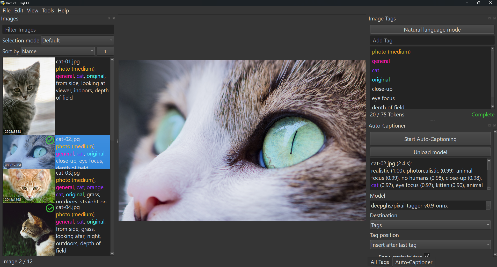
</p>

> **About this fork**
>
> This is a personal fork of [jhc13/taggui](https://github.com/jhc13/taggui).
> Everything beyond the original app by **jhc13** was **entirely "vibe coded"
> with GitHub Copilot** for my own personal use. I'm sharing it in case others
> find it useful, but because of how it was built there are **no guarantees**
> that this fork will be maintained or updated regularly, and there may be
> rough edges. Use it at your own discretion.

## Contents

- [Features](#features)
- [Installation](#installation)
- [Uninstalling / removing](#uninstalling--removing)
- [Getting started](#getting-started)
- [The panes](#the-panes)
- [The tools](#the-tools)
- [Automatic captioning](#automatic-captioning)
- [Advanced syntax reference](#advanced-syntax-reference)
- [Controls and context menus](#controls-and-context-menus)

## Features

- **Fast, keyboard-friendly tagging** — move through a folder and add, edit,
  reorder, and delete tags without reaching for the mouse.
- **Tag autocomplete** built from your own local tag library, so suggestions
  follow you across every folder.
- **Tag Library** with categories (custom names and colors), aliases, and
  implications for consistent, structured tagging.
- **Natural language mode** — store freeform prompt text alongside tags in the
  same caption file.
- **Automatic captioning and tagging** using a range of local vision models,
  including **Qwen3-VL** caption models and the **PixAI v0.9** tagger.
- **Batch tag operations** — find and replace, sort, shuffle, reverse, and
  reorder tags across many images at once.
- **Advanced filtering** for both images and tags, with prefixes, wildcards,
  numeric comparisons, and `AND` / `OR` / `NOT` logic.
- **Completion tracking** — mark images as done to keep your place, with an
  optional check icon on finished thumbnails.
- **Integrated token counter** for estimating caption length.
- **Directory analytics**, **duplicate image detection**, and **booru wiki
  lookups** built in.
- **Import / export settings** and full **keyboard-shortcut customization**.

## Installation

> This fork does not publish prebuilt releases, so you install it by running it
> from source. The steps below are written to be followed even if you have
> never used Python or PowerShell before.

### 1. Install Python

Install **Python 3.12** (recommended; 3.11 also works) from
[python.org](https://www.python.org/downloads/).

- **On Windows:** during installation, tick the box that says **"Add Python to
  PATH"** before clicking Install. This lets you run `python` from any
  terminal.

### 2. Get the code

Download this repository to your computer. The simplest way is:

1. Click the green **Code** button at the top of the GitHub page.
2. Choose **Download ZIP**.
3. Extract the ZIP somewhere you want to keep the app (for example your
   Documents folder).

(If you are comfortable with Git you can instead `git clone` the repository.)

### 3. Set up a virtual environment and install dependencies

A "virtual environment" is a private folder that holds this app's Python
libraries so they don't interfere with anything else on your computer. TagGUI Plus's
launcher automatically uses one named `venv` or `.venv` if it sits next to
`start.py`.

**On Windows**, open **PowerShell**, then run these commands one at a time.
Replace the path in the first command with wherever you extracted the app:

```powershell
# 1. Go into the app folder (change this path to match your computer)
cd "C:\Users\YourName\Documents\taggui"

# 2. Create a virtual environment named "venv"
python -m venv venv

# 3. Activate it (your prompt will now start with "(venv)")
.\venv\Scripts\Activate.ps1

# 4. Install all the required libraries (this can take a while and downloads
#    several gigabytes the first time)
pip install -r requirements.txt
```

> If step 3 fails with a message about scripts being disabled, run
> `Set-ExecutionPolicy -Scope CurrentUser RemoteSigned` once, answer `Y`, then
> try the activate command again.

**On macOS / Linux**, open a terminal and run:

```bash
cd /path/to/taggui
python3 -m venv venv
source venv/bin/activate
pip install -r requirements.txt
```

### 4. Run the app

From the app folder, run:

```powershell
python start.py
```

`start.py` automatically finds and uses the `venv` you created, so you don't
have to activate it every time. **On Windows you can also just double-click
`start.bat`**, which does the same thing.

> **GPU note:** Automatic captioning runs much faster on a compatible NVIDIA
> GPU, but CPU generation also works. On Linux you may also need to install the
> system package `libxcb-cursor0`
> (see [this Stack Overflow answer](https://stackoverflow.com/a/75941575)).

## Uninstalling / removing

TagGUI Plus stores some data **outside** its own folder, so deleting the app folder
by itself does not remove everything. Your caption `.txt` files always live
next to your images and are never touched by uninstalling.

> [!TIP]
> **Planning to reinstall later?** Export your settings first
> (**`File` → `Export / Import Settings…`**) and keep the exported file
> somewhere safe. Removing app data clears your saved preferences, Tag Library,
> and other settings, so exporting first lets you import everything back after
> you reinstall instead of setting it all up again from scratch.

### The easy way (recommended)

Use the built-in cleanup tool: **`File` → `Settings` → `Remove App Data…`**.
Tick what you want to delete — caches and settings are selected by default, and
downloaded models are optional and off by default. TagGUI Plus deletes the selected
items and then **closes immediately** so nothing gets written back. Afterwards,
delete the app folder yourself (the app can't delete its own folder while it's
running).

You can also clear just the thumbnail cache from
**`Settings` → `Clear Thumbnail Cache`**.

### What gets stored where

<details>
<summary>Full list of data locations (click to expand)</summary>

| What it is | Windows | macOS | Linux |
| --- | --- | --- | --- |
| App settings (preferences, autocomplete/local tags, categories, hidden models, etc.) | Registry key `HKEY_CURRENT_USER\Software\taggui\taggui` | `~/Library/Preferences/com.taggui.taggui.plist` | `~/.config/taggui/taggui.conf` |
| Thumbnail cache | `%LOCALAPPDATA%\taggui\thumbnails` | `~/Library/Caches/taggui/thumbnails` | `~/.cache/taggui/thumbnails` |
| Scan caches (`dimension_cache.json`, `caption_cache.json`, `completion_cache.json`) | `%LOCALAPPDATA%\taggui` | `~/Library/Caches/taggui` | `~/.cache/taggui` |
| Downloaded captioning models (often several GB) | Your configured models directory, or the Hugging Face cache `%USERPROFILE%\.cache\huggingface` (or wherever `HF_HOME` points) | Your models directory, or `~/.cache/huggingface` | Your models directory, or `~/.cache/huggingface` |

</details>

<details>
<summary>Removing the leftover data by hand (click to expand)</summary>

**Windows** (run in PowerShell, one line at a time):

```powershell
# Thumbnail cache and scan caches
Remove-Item -Recurse -Force "$env:LOCALAPPDATA\taggui"

# Saved settings (stored in the Windows Registry, not a file)
Remove-Item -Recurse -Force "HKCU:\Software\taggui"

# Downloaded models in the shared Hugging Face cache.
# Only run this if no other tool on your system uses Hugging Face models,
# since this cache is shared. If you set a custom models directory in
# Settings instead, delete that folder rather than this one.
Remove-Item -Recurse -Force "$env:USERPROFILE\.cache\huggingface"
```

**macOS / Linux** (run in a terminal):

```bash
# Caches (thumbnails + scan caches)
rm -rf ~/.cache/taggui          # Linux
rm -rf ~/Library/Caches/taggui  # macOS

# Saved settings
rm -f ~/.config/taggui/taggui.conf                     # Linux
rm -f ~/Library/Preferences/com.taggui.taggui.plist    # macOS

# Downloaded models in the shared Hugging Face cache (see the warning above)
rm -rf ~/.cache/huggingface
```

</details>

Finally, delete the TagGUI Plus app folder itself.

## Getting started

### Loading a directory

Click **`Load Directory`** in the center of the window (or **`File` → `Load
Directory`**) and pick the folder that contains your images. TagGUI Plus shows every
image in that folder (and its subfolders) as a scrollable list of thumbnails.

> [!NOTE]
> **Background thumbnail caching.** Unlike the original TagGUI, this version
> builds thumbnails for a directory *in the background* as soon as it loads,
> instead of only when an image scrolls into view. It saves those thumbnails to
> disk so the work only happens once. This means the **first time** you load a
> large directory it may feel a little slower while the cache fills in (this
> happens quietly in the background and won't block you from working), but
> **every load after that is fast** because the thumbnails are already stored.
> You can turn this off or clear the cache under
> **`File` → `Settings` → Thumbnail cache** if you prefer.

> [!NOTE]
> **Automatic refresh on refocus.** When you switch back to TagGUI Plus after
> changing files elsewhere — for example editing an image in an external image
> editor — it automatically detects what changed on disk and updates the
> affected thumbnails, captions, and file list for you. This refresh is
> **incremental**: it only re-reads the specific files that actually changed
> rather than reloading and re-scanning the entire directory every time, so it
> stays fast even for very large folders. You don't need to manually reload the
> directory; just click back into the TagGUI Plus window and the changes appear.

<p align='center'>
  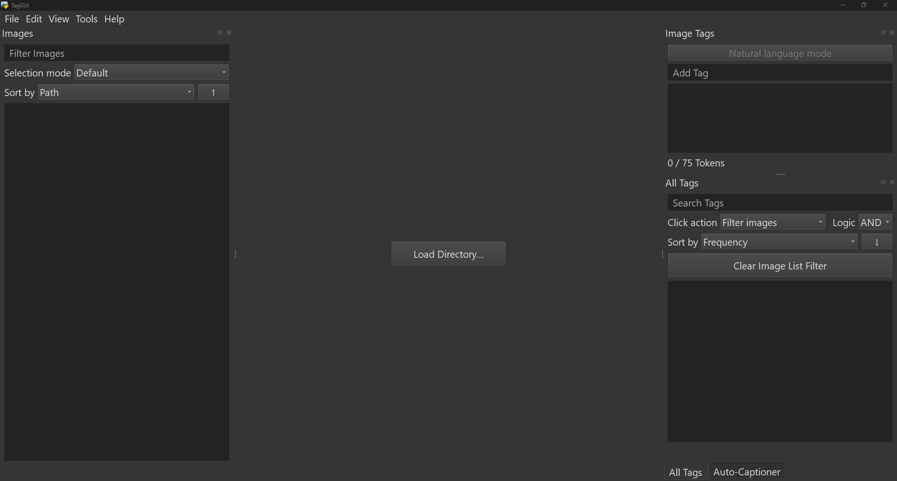
</p>

### How tags and natural language are stored

TagGUI Plus reads and writes a plain-text `.txt` file next to each image, with the
**same name** as the image (for example `cat.png` → `cat.txt`). You never edit
these files directly — TagGUI Plus saves your changes automatically as you work.

Each caption file has two parts:

- **Tags** — the first line, a list of short terms separated by your tag
  separator (a comma by default). This is what most tag-based training tools
  expect.
- **Natural language** — any text *after the first line break*. This is
  freeform prompt text and is optional.

So a caption file might look like this:

```
1girl, red dress, smiling, outdoors
A young woman in a red dress smiles while standing in a sunny garden.
```

Autocomplete suggestions are a separate thing: they are stored **locally by
TagGUI Plus** (not in the caption files), so the tags you use build up a personal
library that follows you across every folder. You manage that library in the
**Tag Library** (see below).

### Adding tags and natural language

- **Add a tag:** type it into the **`Add Tag`** box in the Image Tags pane and
  press `Enter`. Press `Ctrl`+`Enter` to accept the first autocomplete
  suggestion.
- **Add a tag to many images at once:** select multiple images in the list
  first, then add the tag.
- **Add natural language:** turn on **`Natural language mode`** in the Image
  Tags pane and type into the text box.

<p align='center'>
  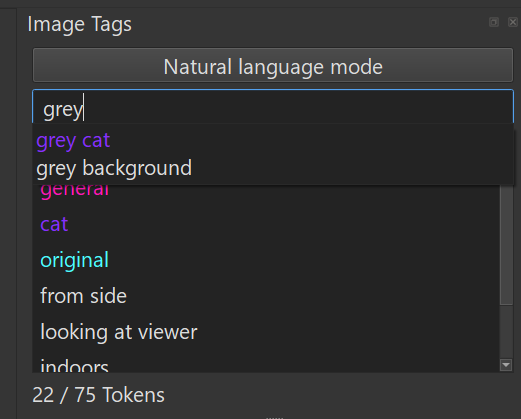
</p>

## The panes

TagGUI Plus's window is made of dockable **panes** around a central image preview.
You can show or hide each one from the **`View`** menu, and drag them to
rearrange or float them.

### Images pane

The scrollable list of thumbnails for the loaded folder.

- **`Filter Images` box** at the top narrows the list using the
  [image filter syntax](#image-filtering-syntax) (tags, names, paths, counts,
  and logic).
- **Sort** the list by path, name, modified/created date, file size,
  resolution, tag count, token count, or natural-language length.
- Thumbnails can show a **resolution badge**, a green **completion check**, and
  an **`[NL]`** marker for images that have natural language text. Tags shown
  under a thumbnail are colored by their category.
- Select multiple images with `Ctrl`/`Shift`+click to edit or caption them as a
  batch.

<p align='center'>
  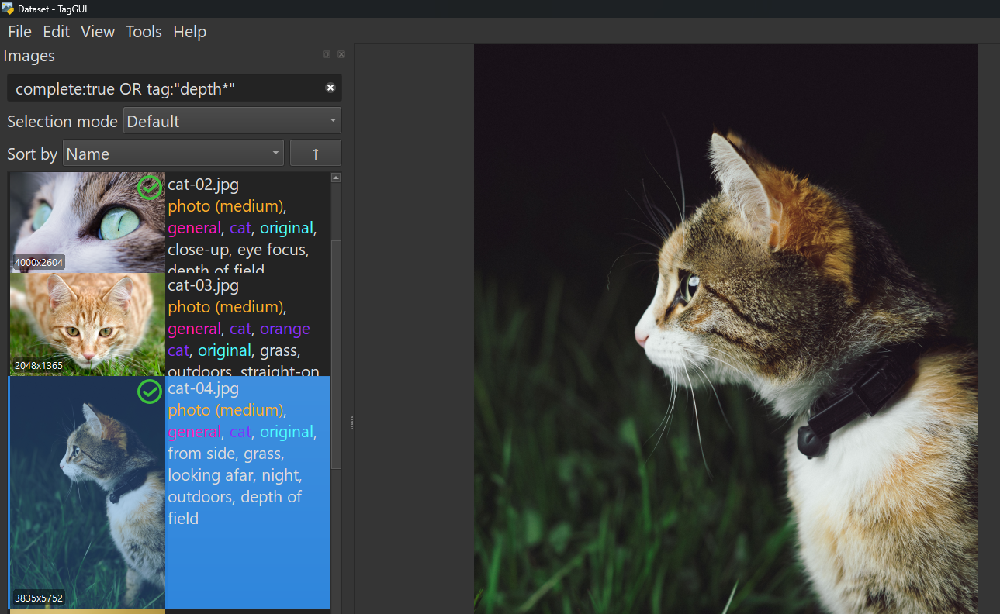
</p>

### Image preview (center)

The large view of the currently selected image.

- **Zoom** with the mouse wheel or `Ctrl`+`+` / `Ctrl`+`-`.
- **Pan** a zoomed image by dragging, or with `Alt`+arrow keys.
- **Reset** the view by double-clicking or pressing `Ctrl`+`0`.

### Image Tags pane

Where you edit the current image's caption.

- **`Add Tag` box** with autocomplete for adding tags.
- **Tag list** below it — double-click to rename, drag to reorder, `Delete` to
  remove. Right-click for options like copying, looking a tag up on a wiki, or
  assigning it to a category.
- **`Natural language mode`** button toggles the pane between the tag list and a
  freeform text editor for the natural-language part of the caption.
- A **token counter** shows the caption length and turns red when it passes the
  token limit. A green **`Complete`** label appears when the image is marked as
  complete.

<p align='center'>
  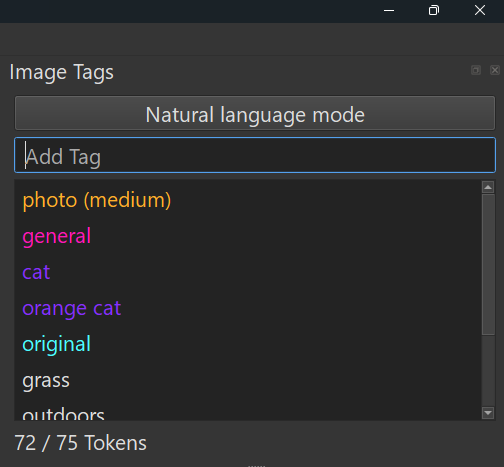
  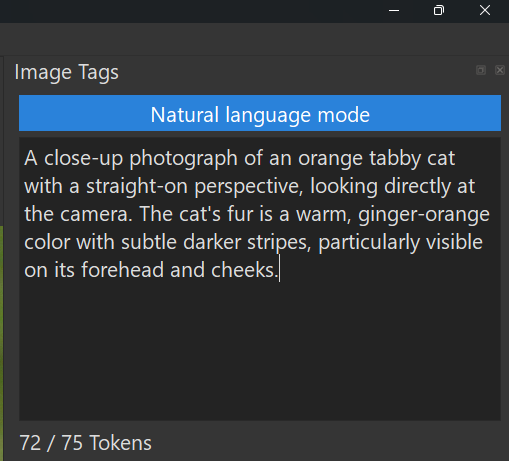
</p>

### All Tags pane

A live list of **every tag used** across the loaded folder, with how many times
each is used.

- **`Search Tags` box** filters the list with the
  [tag filter syntax](#tag-filtering-syntax) (name, category, count, length,
  wildcards, logic).
- **Click action** toggles what selecting a tag does: **filter the image list**
  for that tag, or **add the tag** to the selected images.
- When filtering by several tags at once, choose **`AND`** or **`OR`** logic.
- **Sort** by frequency, name, or category, ascending or descending.
- Right-click a tag to copy it, look it up on a wiki, assign/clear its category,
  or rename/delete every instance of it.

<p align='center'>
  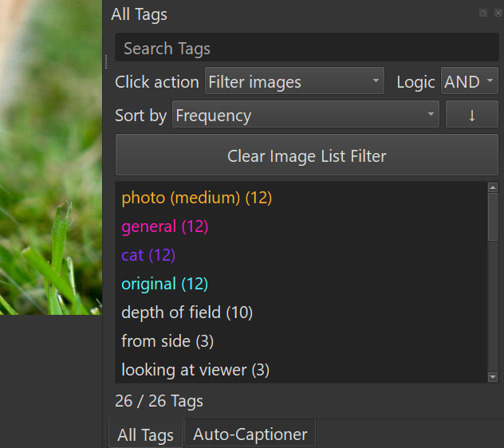
</p>

### Auto-Captioner pane

Configures and runs [automatic captioning](#automatic-captioning). It holds the
model selector, prompt box, destination and position options, and the
**`Start Auto-Captioning`** button, plus a progress bar and console output while
it runs.

## The tools

Most tools live in the **`Tools`** and **`Edit`** menus.

### Tag Library

**`Tools` → `Tag Library…`** (`Ctrl`+`L`). Your personal, structured tag
vocabulary — the source of autocomplete and category coloring.

- **Tags tab:** add, rename, remove, and search tags; assign each a category.
  Import and export tags (CSV / Excel), or download starter templates.
- **Categories tab:** create categories with custom names and colors.
- **Aliases tab:** map alternate spellings to a canonical tag.
- **Implications tab:** when you add one tag, related tags can be added
  automatically (controlled by a setting).
- **Profiles tab:** build named sets of tag mappings (`original tag` →
  `replacement`). Apply a profile to swap every matching tag across the loaded
  directory in one step, or revert it to change those tags back — handy for
  switching a folder between different tag vocabularies or naming conventions.

<p align='center'>
  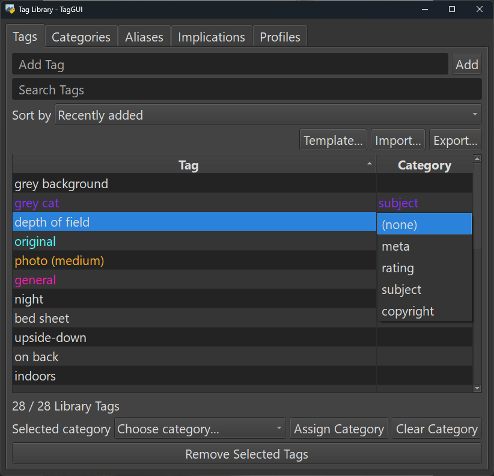
</p>

### Find and Replace

**`Edit` → `Find and Replace…`** (`Ctrl`+`R`). Batch-replace text in tags and
captions.

- **Scope:** current image, all selected images, or the entire folder.
- **`Whole tags only`** matches complete tags as units (leave the replace box
  empty to *delete* matching tags, or fill it to *rename* them).
- **`Use regex for find text`** enables regular-expression patterns.
- The button shows a live count of how many instances will change.

### Batch Reorder Tags

**`Edit` → `Batch Reorder Tags…`** (`Ctrl`+`B`). Reorder tags across all
selected images in one action:

- Sort **alphabetically**, by **frequency**, or by **category order**.
- **Reverse** or **shuffle** the tag order.
- **Move specific tags to the front** (comma-separated).
- Optionally **keep the first tag fixed** during any operation.
- For category sorting, drag the categories into the priority order you want.

You can pick a **default** reorder in Settings so it's preselected here and can
be triggered directly with the **`Apply Default Batch Reorder`** shortcut.

### Find Duplicates

**`Tools` → `Find Duplicates…`**. Detects identical and near-identical images
using perceptual hashing and shows each group side by side.

- A **strictness slider** controls how similar images must be to count as
  duplicates (0 = visually identical, higher = more lenient).
- For each group you **keep one image**; the rest can be sent to the **Recycle
  Bin/Trash**, **moved to a folder**, or **tagged as `duplicate`** for later
  review.

> [!WARNING]
> The strictness slider is **very sensitive to variant sets** — groups of images
> made up of a base image plus one or more alternate versions (edits, recolors,
> minor touch-ups, etc.). Even a slightly lenient setting can flag these
> intentional variants as duplicates. If your dataset contains a lot of variant
> sets, it's strongly recommended to keep the strictness **very strict**, or
> simply leave it on **exact / identical only (0)**, to avoid grouping images you
> meant to keep separate.

<p align='center'>
  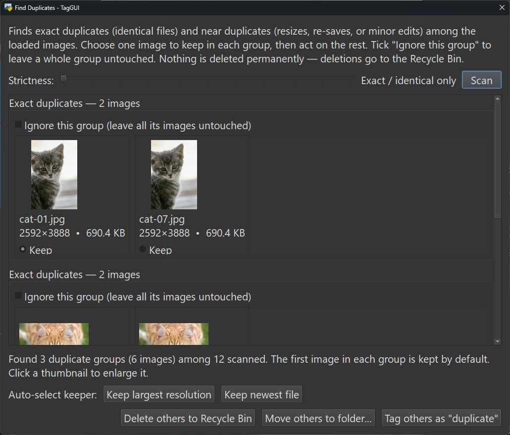
</p>

### Directory Analytics

**`Tools` → `Directory Analytics…`**. A read-only report on the loaded folder —
nothing is changed. Tabs cover an **overview** (counts, size, formats),
**resolution** stats, **captions & tags** coverage, **housekeeping** (orphaned
or missing caption files), and a **per-subfolder** breakdown. Results can be
exported to CSV or Markdown.

<p align='center'>
  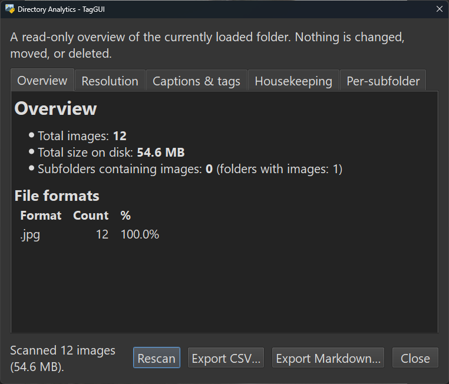
</p>

### Danbooru / Gelbooru Wiki

**`Tools` → `Danbooru Wiki…`** (`Ctrl`+`D`) and
**`Tools` → `Gelbooru Wiki…`** (`Ctrl`+`G`), also available by right-clicking a
tag. These look up a tag's meaning on the Danbooru or Gelbooru wikis so you can
learn what a tag means and see related tags, then add it to your Tag Library or
to the selected images.

The **Danbooru Wiki** in particular does more than a plain tag lookup:

- **Wiki lookup:** read a tag's description and see its related and aliased
  tags.
- **Tag groups:** browse Danbooru's curated tag-group pages, which collect
  related tags together by theme — a handy way to discover tags you might not
  have thought to search for.
- **Post search:** view example posts for a tag directly inside the dialog. This
  is meant to give you **extra visual context for what a tag actually
  represents**, not to serve as a replacement for browsing posts on the Danbooru
  site itself — it's a quick reference, not a full booru browser.

You reach tag groups and post search through the **search bar** using simple
prefixes:

- To search a **tag group**, type `tag group:` followed by the group name — for
  example `tag group:hair`. Typing just `tag group:` on its own suggests
  matching groups via autocomplete, but for a **complete list** it's better to
  look up the **`tag groups`** wiki page itself (type `tag groups` into the
  search bar with no prefix), which lists every tag group in its table of
  contents.
- To search **posts** for a tag, type `posts:` followed by the tag — for example
  `posts:no humans`.
- Typing anything without a prefix does a normal wiki lookup for that tag.

> [!NOTE]
> These wiki tools depend on Danbooru's and Gelbooru's **external websites and
> APIs**. If those sites change how their data is served (or restrict access),
> the lookups may stop working until TagGUI Plus is updated to match. In other words,
> this feature relies on services outside of TagGUI Plus's control and could break
> unexpectedly.

> ⚠️ **NSFW warning:** Danbooru and Gelbooru are adult (NSFW) image board sites.
> Because these tools query those sites directly, **the wiki lookups in TagGUI Plus
> are NSFW** — search results and related content can be explicit. Use them with
> that in mind.

### Settings

**`File` → `Settings…`** (`Ctrl`+`Alt`+`S`) collects all preferences.

<details>
<summary>Overview of the available settings (click to expand)</summary>

- **Global:** font size, light/dark theme, and a button to customize keyboard
  shortcuts.
- **Images pane:** list text size, which file types to show, thumbnail width,
  the resolution badge (and its size/transparency), the completion check icon,
  max preview zoom, and auto-focusing the Add Tag box when you type. **Note:**
  setting the **max preview zoom** very high can cause performance issues when
  zoomed in on large images. TagGUI Plus mitigates this — for example it
  automatically switches to faster (lower-quality) rendering above 10x zoom and
  sharpens the image once you stop zooming — but it's still recommended to keep
  this value on the lower side.
- **Thumbnail cache:** max cache size, background caching, and a button to clear
  the cache. If you work with **very large directories**, consider raising the
  max cache size so more thumbnails stay cached on disk instead of being evicted
  and regenerated later.
- **Image Tags pane:** the tag separator character, whether to add a space after
  it, autocomplete on/off, the token limit, and the default batch-reorder
  operation.
- **Auto-Captioner:** a custom models directory and per-model visibility (hide
  models you don't use).
- **Tag Library:** default keep/remove behavior, default category for new tags,
  whether to prompt for a category, and how implications are auto-applied. **Tip:**
  if you'd rather ignore the Tag Library and have an experience closer to the
  original TagGUI, set **Default choice: keep or remove from Tag Library** to
  **Remove**, set **Default category for new tags** to **No category**, and
  **uncheck** both **Ask whether to keep or remove from Tag Library** and **Ask
  before assigning category to new tags**.
- **External tools:** the image editor executable used by "Open Image in
  Configured Editor".
- **Footer:** `Remove App Data…` and `Reset to Defaults`.

</details>

You can also **export** and **import** your settings (**`File` → `Export /
Import Settings…`**), choosing which parts (Tag Library, auto-captioner
settings, completion marks) to include.

## Automatic captioning

Beyond manual tagging, TagGUI Plus can generate captions or tags for your images
locally using vision models.

<p align='center'>
  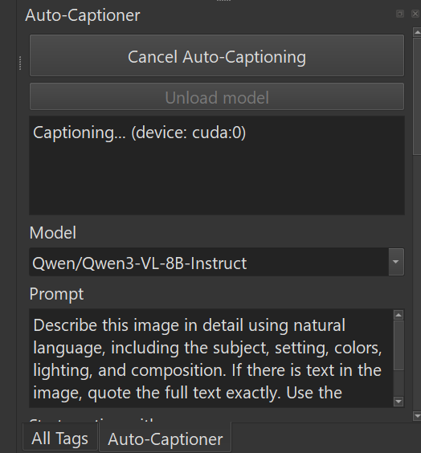
</p>

**To use it:** select the images you want in the Images pane, choose a model in
the Auto-Captioner pane, then click **`Start Auto-Captioning`**. The first use
of a model downloads and loads it (this can take a few minutes and several GB);
later runs are much faster. If you keep previously downloaded models in a local
folder, set that folder in **`Settings`** to include them in the model list.
Generated output can go to the **tag list** or the **natural language** section
of the caption.

### Supported models

TagGUI Plus supports two kinds of models:

- **Caption models** produce natural-language descriptions: **Florence-2**,
  **JoyCaption**, **Moondream**, **Phi-3-Vision**, **Kosmos-2**,
  **LLaVA / LLaVA-Next / LLaVA-Llama-3**, and the **Qwen-VL** family —
  including **Qwen2-VL**, **Qwen2.5-VL**, and **Qwen3-VL** (with both
  `Instruct` and `Thinking` variants).
- **Tagger models** produce booru-style tags: the **WD (Waifu Diffusion)
  Tagger** family and the **PixAI Tagger** — including **PixAI v0.9**
  (`deepghs/pixai-tagger-v0.9-onnx`).

> Qwen3-VL requires a recent Transformers version, which the pinned
> `requirements.txt` already provides.

### Captioning options

<details>
<summary>Prompt, destination, and generation options (click to expand)</summary>

- **`Prompt`** — instructions for the model. You can insert per-image
  information with template variables: `{tags}` (the image's tags), `{name}`
  (file name without extension), and `{directory}` / `{folder}` (containing
  folder name). Example: `Describe the image using these tags: {tags}`.
- **`Start caption with`** — text every generated caption begins with.
- **`Destination`** — send output to **`Tags`** or **`Natural language`** (saved
  per model).
- **`Tag position`** / **`Natural language position`** — where generated text is
  inserted relative to existing content.
- **`Remove tag separators in caption`** — strip commas from generated captions
  before adding them as tags.
- **`Discourage from caption`** — comma-separated words/phrases to avoid (e.g.
  `appears,seems,possibly`). Not guaranteed due to tokenization.
- **`Include in caption`** — comma-separated words/phrases that should appear;
  use `|` to let the model pick one from a group (e.g.
  `cat,orange|white|black`).
- Standard generation parameters (beams, sampling, temperature, top-k/top-p,
  repetition penalty, token limits, etc.) are also available and follow the
  [Hugging Face generation docs](https://huggingface.co/docs/transformers/main/en/main_classes/text_generation#transformers.GenerationConfig).

</details>

<details>
<summary>Tagger options and tag-filter rules (WD / PixAI taggers)</summary>

Tagger models add extra options: **show probabilities**, a **minimum
probability** threshold, a **maximum number of tags**, and **`Tag filters`** —
comma-separated rules to exclude or rewrite generated tags. Each comma-separated
item is one rule.

- `solo` — remove the exact tag `solo`
- `1girl:person` — replace the exact tag `1girl` with `person`
- `red*` — remove tags starting with `red` (on word boundaries)
- `*hair:wig` — replace a trailing `hair` phrase with `wig`
- `*hair*:wig` — replace `hair` anywhere inside a tag

**Exclude rules**

| Rule | Effect | Example matches | Example non-matches |
| --- | --- | --- | --- |
| `phrase` | Remove only the exact tag | `hair` | `black hair`, `facial-hair` |
| `phrase*` | Remove tags that start with the phrase | `red`, `red eyes`, `red+vehicle` | `orange red`, `redirect` |
| `*phrase` | Remove tags that end with the phrase | `hair`, `black hair`, `facial-hair` | `hair style`, `chair` |
| `*phrase*` | Remove tags containing the phrase | `hop scotch`, `my hop`, `my-hop-tag` | `hope` |

**Replace rules**

| Rule | Effect | Example output |
| --- | --- | --- |
| `source:target` | Replace the exact tag | `hair → wig` |
| `source*:target` | Replace the matching prefix phrase | `red eyes → blue eyes` |
| `*source:target` | Replace the matching suffix phrase | `black hair → black wig` |
| `*source*:target` | Replace the matching internal phrase | `big hair style → big wig style` |

Word boundaries are any non-alphanumeric character (spaces, `+`, `-`, etc.).
Exact rules run before wildcard rules, and replace rules run before exclude
rules. To use a literal comma or colon, wrap that side in double quotes (e.g.
`smile:":)"`). If a replacement contains commas, it is inserted as multiple
tags.

</details>

## Advanced syntax reference

Both the image filter and the tag filters support prefixes, wildcards, and
logical operators. The full details live in the collapsible sections below.

### Image filtering syntax

Click a tag in the **All Tags** pane to filter for it, or type a filter in the
**`Filter Images`** box for more control.

<details>
<summary>Full image filter syntax (click to expand)</summary>

**Text prefixes**

- `tag:` — images that have the term as a tag (`tag:cat`)
- `caption:` — the term appears anywhere in the caption string
- `nl:` — natural language content or presence (`nl:true`, `nl:false`,
  `nl:"red coat"`)
- `complete:` — completion state (`complete:true`, `complete:false`)
- `name:` — the term appears in the file name
- `path:` — the term appears in the full file path
- No prefix — matches the caption **or** file path

**Numeric prefixes** (operators `=`/`==`, `!=`, `<`, `>`, `<=`, `>=`)

- `tags:` — number of tags (`tags:=13`, `tags:!=7`)
- `chars:` — characters in the caption (`chars:<100`, `chars:>=30`)
- `tokens:` — tokens in the caption (`tokens:>75`, `tokens:<=50`)

**Spaces and quotes** — wrap terms containing spaces in quotes:
`tag:"orange cat"`. Escape inner quotes with `\`, or mix quote types:
`tag:'orange "cat"'`.

**Wildcards** — `*` matches any number of characters, `?` matches one.
`tag:*cat` matches `orange cat`, `large cat`, and `cat`.

**Combining filters** — `NOT`, `AND`, `OR` (lowercase works too). Precedence is
`NOT` > `AND` > `OR`; use parentheses to change it, e.g.
`tag:cat AND (tag:orange OR tag:white)`.

</details>

### Tag filtering syntax

The **`Search Tags`** box in the All Tags pane and the **`Filter Tag Library`**
box in the Tag Library use the same style of syntax, applied to each tag.

<details>
<summary>Full tag filter syntax (click to expand)</summary>

**Text prefixes**

- `tag:` — tags whose name matches the term (wildcards allowed):
  `tag:*hair` matches `long hair`, `short hair`
- `category:` — tags in a category whose name contains the term
  (`category:Character`); use `category:none` or `category:uncategorized` for
  tags with no category
- No prefix — matches tags whose name contains the term

**Numeric prefixes** (operators `=`/`==`, `!=`, `<`, `>`, `<=`, `>=`)

- `count:` — how many times a tag is used (All Tags pane only): `count:>10`
- `length:` — number of characters in the tag name: `length:<=3`

Spaces/quotes, wildcards, and `NOT` / `AND` / `OR` work the same as in the image
filter. Example: `category:"Character" AND NOT tag:*_hair`.

</details>

### Marking images as complete

As you tag, you can mark images as **complete** to track your progress. This
marker is stored separately by TagGUI Plus (in `completion_cache.json`) and is
**never written to your caption files**, so it never becomes part of your
dataset. It persists across sessions and folder changes.

- Mark/unmark with **`Ctrl`+`K`** / **`Ctrl`+`Shift`+`K`**, or via the
  right-click menu.
- Completed images show a green check in the thumbnail corner (toggle it in
  Settings).
- Press **`Ctrl`+`Shift`+`J`** to jump to the first incomplete image, or filter
  with `complete:false`.

## Controls and context menus

Keyboard shortcuts are fully customizable in **`Settings` → `Keyboard
shortcuts`**; the defaults are listed below.

### Global

| Action | Shortcut |
| --- | --- |
| Load / Reload Directory | `Ctrl`+`Alt`+`L` / `F5` |
| Settings | `Ctrl`+`Alt`+`S` |
| Exit | `Ctrl`+`W` |
| Undo / Redo | `Ctrl`+`Z` / `Ctrl`+`Y` |
| Find and Replace | `Ctrl`+`R` |
| Batch Reorder Tags | `Ctrl`+`B` |
| Tag Library | `Ctrl`+`L` |
| Danbooru / Gelbooru Wiki | `Ctrl`+`D` / `Ctrl`+`G` |
| Previous / next image | `Ctrl`+`Up` / `Ctrl`+`Down` |
| Jump to first untagged / incomplete image | `Ctrl`+`J` / `Ctrl`+`Shift`+`J` |

### Focus shortcuts

| Focus | Shortcut |
| --- | --- |
| `Filter Images` box | `Alt`+`F` or `Ctrl`+`F` |
| `Add Tag` box | `Alt`+`A` |
| Image Tags list | `Alt`+`I` |
| `Search Tags` box | `Alt`+`S` |
| `Start Auto-Captioning` button | `Alt`+`C` |

### Images pane

- Zoom preview: mouse wheel or `Ctrl`+`+` / `Ctrl`+`-`; pan: drag or
  `Alt`+arrows; reset: double-click or `Ctrl`+`0`
- First / last image: `Home` / `End`
- Select multiple: `Ctrl`/`Shift`+click; Select all: `Ctrl`+`A`; Invert:
  `Ctrl`+`I`
- Switch between selected images without changing the selection: `Left` /
  `Right`
- Mark complete / incomplete: `Ctrl`+`K` / `Ctrl`+`Shift`+`K`
- **Right-click menu:** copy tags/caption/name/path, paste tags, open image or
  caption file, open in your configured editor, rename the image file, move or
  copy images to another folder, delete images, and mark complete/incomplete.

### Image Tags pane

- Add a tag: type in `Add Tag` and press `Enter`; accept first suggestion:
  `Ctrl`+`Enter`
- Add a tag to multiple images: select them first, then add the tag
- Rename a tag: double-click or `F2`; delete: `Delete`; reorder: drag and drop
- **Right-click a tag:** copy it, view it on the Danbooru/Gelbooru wiki, or
  assign/clear its category.

### All Tags pane

- Select a tag to filter images for it, or click to add it to selected images
  (depending on the click-action setting)
- Rename every instance: double-click or `F2`; delete every instance: `Delete`
- **Right-click a tag:** copy, wiki lookup, assign/clear category.

---

Original app by [jhc13](https://github.com/jhc13/taggui). This fork's additional
changes were vibe coded with GitHub Copilot and are shared as-is.
